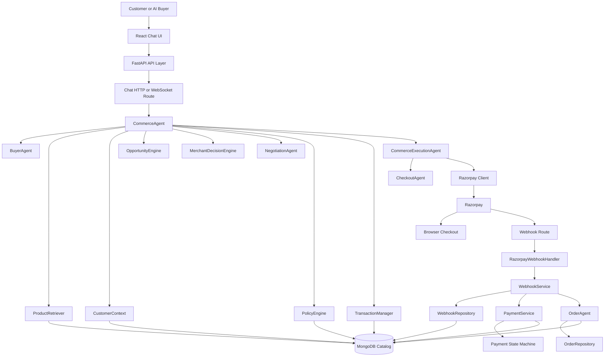
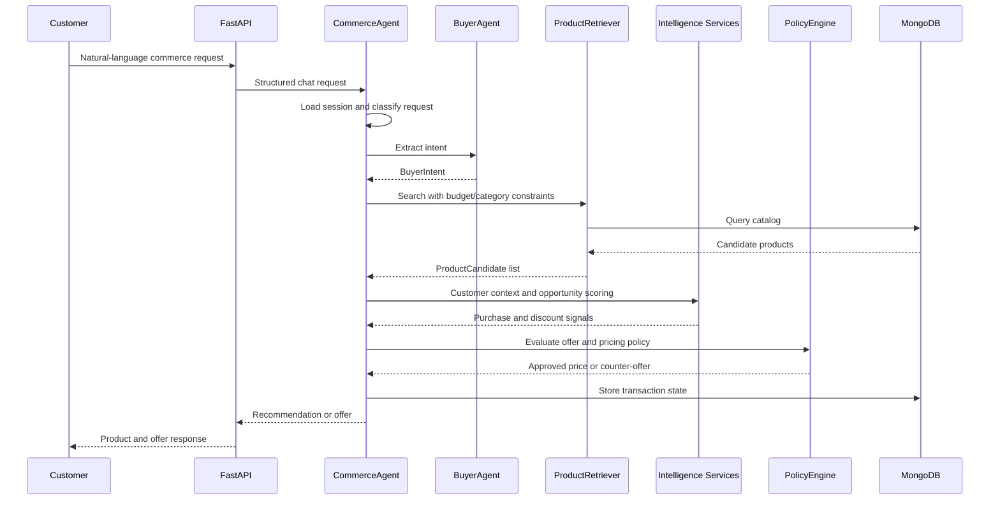
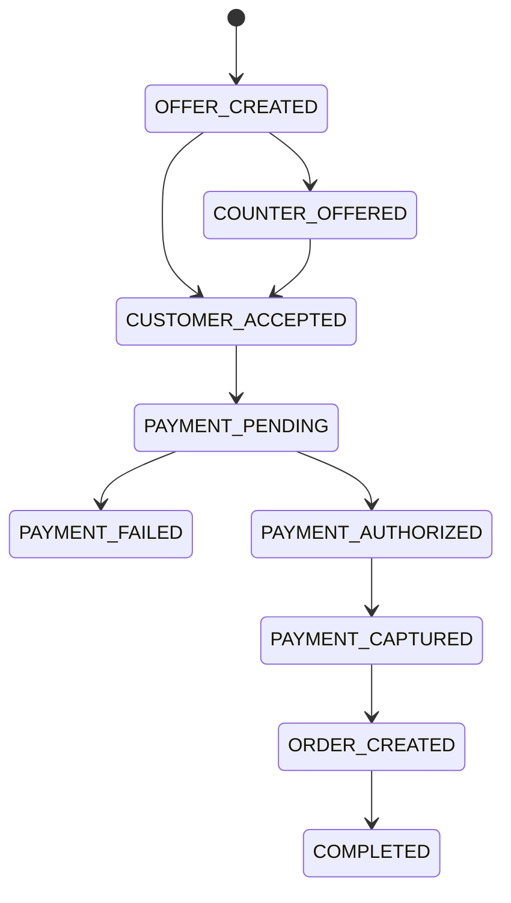
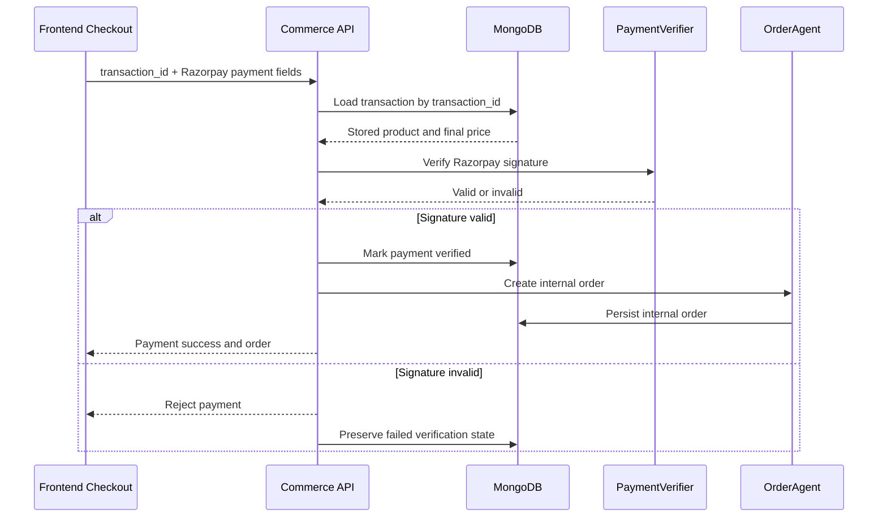
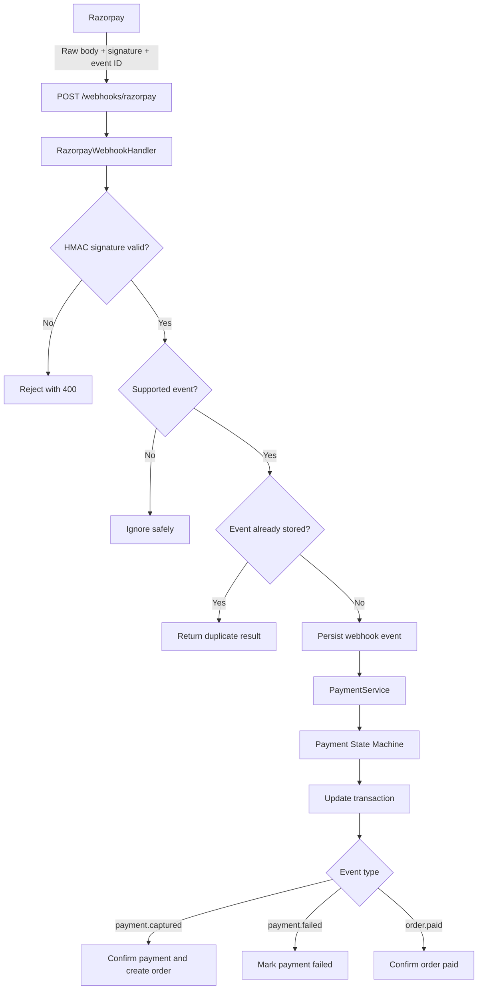
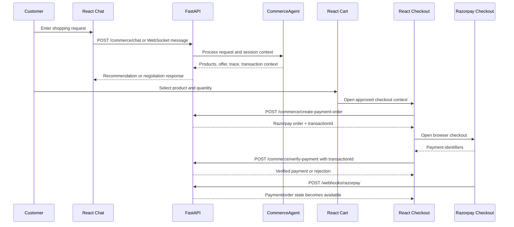
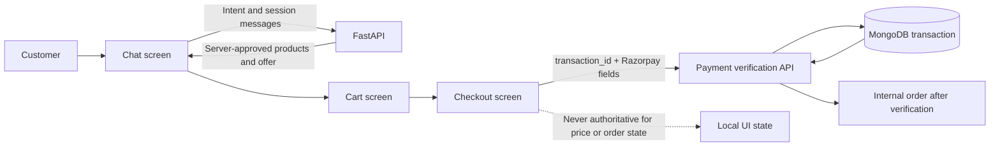

# AgentCommerce OS

AgentCommerce OS is an AI-first commerce platform that turns a natural-language shopping request into a server-controlled product decision, bounded offer, checkout, verified payment, and internal order.

The central design principle is simple:

> AI can understand intent and negotiate within limits. Deterministic backend services control price, payment verification, transaction state, and order creation.

This is not a chatbot with a payment button attached. It is a commerce decision and execution system with a conversational interface.

## Core Flow

```text
Customer request
	  |
	  v
Buyer intent -> Product retrieval -> Customer context -> Opportunity scoring
	  |
	  v
Merchant decision -> Bounded negotiation -> Deterministic policy validation
	  |
	  v
Approved transaction -> Razorpay order -> Signature-verified payment
	  |
	  v
Webhook processing -> Internal order -> Completed commerce lifecycle
```

## Architecture

The platform is divided into two workflows:

1. **Commerce decision flow**: understands what the customer wants and determines which product and price are allowed.
2. **Payment and fulfillment flow**: executes the approved transaction and creates an internal order only after trusted payment confirmation.



### Responsibility boundaries

| Component | Responsibility |
| --- | --- |
| FastAPI routes | Stable HTTP and WebSocket entry points |
| `CommerceAgent` | Orchestrates the commerce decision pipeline |
| `BuyerAgent` | Converts natural language into structured buyer intent |
| `ProductRetriever` | Finds eligible products using server-side constraints |
| `CustomerContext` | Loads customer-level buying signals |
| `OpportunityEngine` | Calculates purchase and discount opportunity |
| `MerchantDecisionEngine` | Chooses recommend, negotiate, counter, or reject |
| `NegotiationAgent` | Performs bounded negotiation without owning final pricing |
| `PolicyEngine` | Enforces merchant limits, margin protection, and final price rules |
| `TransactionManager` | Persists the bridge between offer, payment, and order |
| `CommerceExecutionAgent` | Executes an approved decision through checkout |
| `CheckoutAgent` | Validates checkout readiness and payment inputs |
| `RazorpayClient` | Creates external Razorpay payment orders |
| `PaymentVerifier` | Verifies Razorpay payment signatures |
| `RazorpayWebhookHandler` | Validates raw webhook bodies and event signatures |
| `WebhookService` | Persists and processes verified asynchronous events |
| `PaymentService` | Applies deterministic payment state transitions |
| `OrderAgent` | Creates the internal order after verified payment |
| MongoDB repositories | Isolate durable persistence from business logic |

## Decision Pipeline

When a customer says, for example, `I want something under INR 500`, the request moves through the following stages:

1. FastAPI accepts the request and associates it with a customer and chat session.
2. The session store restores relevant conversation and transaction context.
3. `BuyerAgent` extracts intent, budget, category, urgency, discount request, target price, and result limit.
4. `ProductRetriever` searches the catalog with server-side price and category constraints.
5. `CustomerContext` loads known signals such as purchase count, lifetime value, affinity, and discount dependence.
6. `OpportunityEngine` estimates purchase and discount opportunity.
7. `MerchantDecisionEngine` selects the commercial action.
8. `NegotiationAgent` calculates a bounded offer or counter-offer.
9. `PolicyEngine` validates the final price against merchant policy and margin rules.
10. `TransactionManager` stores the approved offer and its lifecycle state.



### AI is advisory, not authoritative

The AI layer may identify that a customer wants a product under a budget or requests a discount. It cannot:

- Change the catalog price.
- Approve an arbitrary discount.
- Create a Razorpay order directly.
- Mark a payment as successful.
- Create an internal order.

External model failures are handled with configured fallbacks and a local deterministic intent fallback so the structured pipeline remains available.

## Transaction Lifecycle

A transaction is the durable bridge between the conversational decision and payment execution. It stores the customer, product, original price, approved discount, final price, quantity, Razorpay order ID, payment state, and internal order ID.



The exact transitions are controlled by the transaction and payment services. A browser response or model response cannot skip verification or create an order by itself.

## Payment Security

Payment verification is server-authoritative. The frontend sends the transaction identifier and Razorpay payment fields. The backend loads product identity and approved pricing from MongoDB.



### Trusted payment rules

- `transaction_id` is required for verification.
- Frontend product IDs, prices, and discounts are not used as financial truth.
- The final amount comes from the persisted transaction.
- Razorpay signature verification is mandatory.
- Invalid payment never creates an internal order.
- A Razorpay order and an internal commerce order are separate records.

## Razorpay Webhooks

Webhooks handle asynchronous payment confirmation even when the browser closes or the client loses connection.



The handler verifies the exact raw request body using HMAC-SHA256. `WebhookRepository` persists the event ID under a unique index, making duplicate detection database-backed and safe across processes.

Supported event behavior:

| Event | Result |
| --- | --- |
| `payment.captured` | Mark payment captured, update transaction, create or confirm internal order |
| `payment.failed` | Mark payment and transaction failed; do not create an order |
| `order.paid` | Confirm the paid transaction state |

In a production deployment, order creation can be moved from inline processing to a durable worker such as Celery, RQ, or a managed queue.

## Persistence Model

MongoDB is the durable source of truth for commerce state. Repositories keep database access separate from agent and route logic.

| Collection | Purpose |
| --- | --- |
| `products` | Product catalog and product metadata |
| `customers` | Customer records and commerce context |
| `transactions` | Offer, checkout, payment, and order lifecycle |
| `payments` | Payment state-machine records |
| `webhook_events` | Audited Razorpay events with unique event IDs |
| `orders` | Internal orders created after trusted payment confirmation |
| Policy and decision collections | Merchant rules, decisions, and audit data |

The local `ChatSessionStore` uses one JSON file per session. It stores conversation context, customer association, and transaction references, but it is not the financial source of truth. The interface is designed to be replaced by Redis with distributed locks and TTLs for multi-instance deployments.

## API Surface

The FastAPI application is defined in `Backend/api/main.py`.

| Route | Purpose |
| --- | --- |
| `GET /` | Service status |
| `GET /health` | Health check |
| `POST /commerce/chat` | Process a conversational commerce request |
| `GET /commerce/chat/session/{session_id}` | Restore a chat session |
| `WS /commerce/chat/ws` | Live conversational commerce channel |
| `GET /commerce/session/{customer_id}` | Read the current server-generated offer/session state |
| `POST /commerce/create-payment-order` | Create a Razorpay order from approved transaction data |
| `POST /commerce/verify-payment` | Verify payment using a required transaction ID |
| `POST /webhooks/razorpay` | Receive and process verified Razorpay events |

## Project Structure

```text
AgentCommerce OS/
├── Backend/
│   ├── api/
│   │   ├── main.py
│   │   └── routes/
│   ├── data/
│   │   ├── catalog/
│   │   ├── features/
│   │   ├── intelligence/
│   │   ├── policies/
│   │   └── sessions/
│   ├── script/
│   │   ├── agents/
│   │   ├── checkout/
│   │   ├── context/
│   │   ├── database/
│   │   ├── intelligence/
│   │   ├── payment/
│   │   ├── policy/
│   │   ├── transaction/
│   │   └── webhook/
│   └── requirements.txt
├── Frontend/
│   ├── src/
│   │   ├── components/
│   │   ├── lib/
│   │   ├── Pages/
│   │   ├── App.jsx
│   │   └── main.jsx
│   └── package.json
├── architecture.md
└── Notes/
```

## Local Development

### Backend

From the repository root:

```powershell
cd Backend
python -m venv .venv
.venv\Scripts\Activate.ps1
pip install -r requirements.txt
uvicorn api.main:app --reload
```

The API runs at `http://localhost:8000`. Interactive API documentation is available at `http://localhost:8000/docs`.

Configure the required environment values for MongoDB, Razorpay, and model providers using the project environment configuration before exercising payment or model-backed flows.

### Frontend

In a second terminal:

```powershell
cd Frontend
npm install
npm run dev
```

The Vite client runs at `http://localhost:5173` and is configured by the backend CORS settings for local development.

Useful frontend commands:

```powershell
npm run lint
npm run build
```

## Reliability and Production Considerations

The architecture is ready for production hardening, while the current workspace intentionally uses local development adapters in places:

- Replace JSON sessions with Redis or another shared session store.
- Replace process-local locks with distributed locks.
- Queue webhook fulfillment and add retry/dead-letter handling.
- Clean historical duplicate payment IDs before creating production unique indexes.
- Store secrets in a managed secret store.
- Add authentication, authorization, rate limiting, TLS, and production CORS configuration.
- Add structured logs, metrics, tracing, and correlation IDs across session, transaction, payment, webhook, and order records.
- Run load, deployment, disaster-recovery, and security validation before launch.

The accurate claim is: AgentCommerce OS has a production-ready commerce safety model and backend architecture; selected local infrastructure adapters still need to be promoted to shared production services during deployment.

## Testing

The project currently has **121 passing test cases** across the commerce decision, transaction, payment, webhook, security, and order workflows.

The test coverage validates the most important system boundaries:

- Buyer intent extraction and deterministic fallback behavior.
- Product retrieval with budget, category, and constraint handling.
- Customer-scoped session and memory isolation.
- Merchant decisions, bounded negotiation, and policy enforcement.
- Transaction creation and lifecycle transitions.
- Server-authoritative payment verification using persisted transaction data.
- Rejection of frontend price or product manipulation during payment verification.
- Razorpay signature validation and invalid webhook rejection.
- Duplicate webhook detection through persisted event IDs.
- Payment state-machine behavior for captured and failed payments.
- Internal order creation only after trusted payment confirmation.

Run the backend test suite from the `Backend` directory:

```powershell
pytest -q
```

The frontend also provides validation commands for linting and production builds:

```powershell
cd Frontend
npm run lint
npm run build
```

## Frontend

The frontend is a React and Vite interaction surface for the backend workflows. It never owns pricing, payment success, transaction state, or order authority.

### Screens and routes

| Route | Screen | Role |
| --- | --- | --- |
| `/` or `/chat` | Chat | Start or continue a conversational shopping session |
| `/commerce/chat/session/:sessionId` | Restored chat | Reopen an existing session and its context |
| `/cart` | Cart | Review selected products and quantities |
| `/checkout` | Checkout | Load the server-generated offer and start Razorpay checkout |

### Frontend-to-backend flow



### Frontend trust boundary



The checkout screen stores the `transactionId` returned when the backend creates the payment order. During verification it sends the transaction ID and Razorpay identifiers only; product prices and discounts are resolved from the persisted server transaction.

## License and Status

This repository is an active architecture and implementation workspace for AgentCommerce OS. See the project notes and architecture documents for deeper design decisions, testing notes, and phase history.
